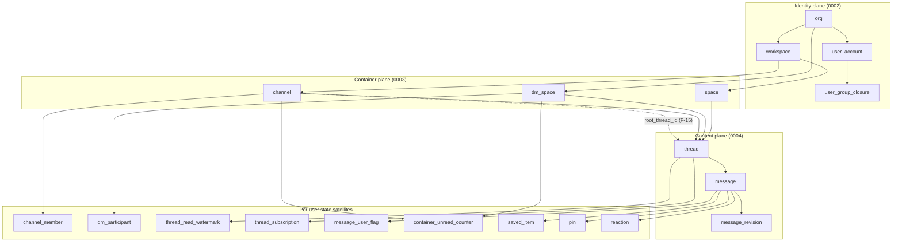
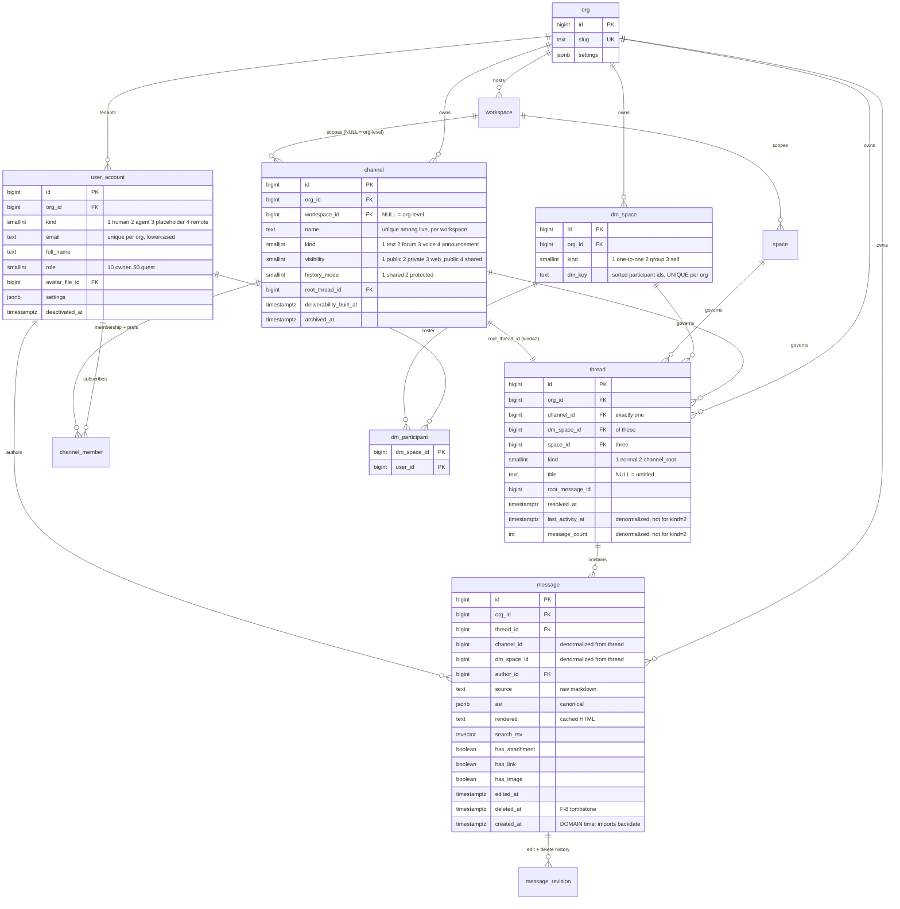
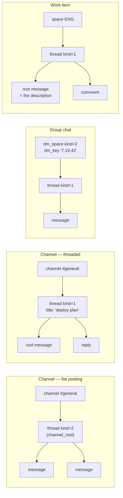
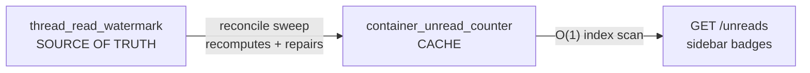
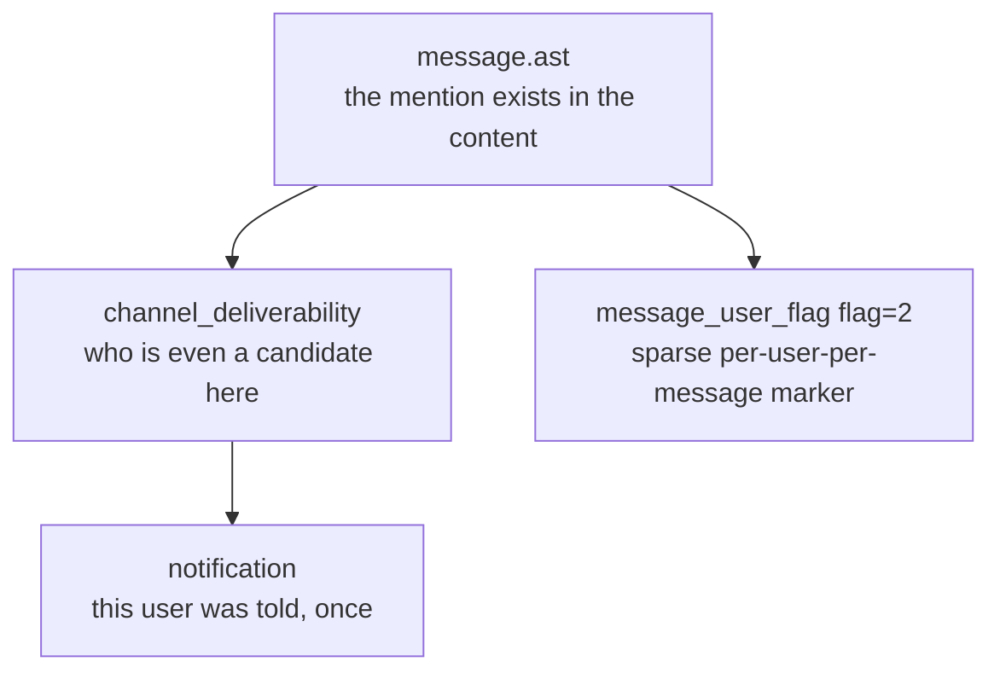
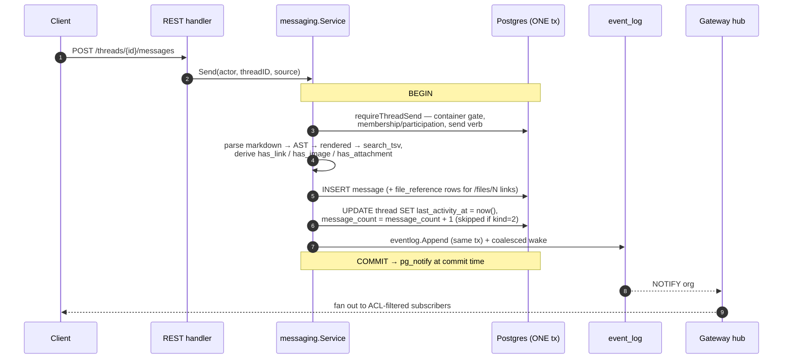
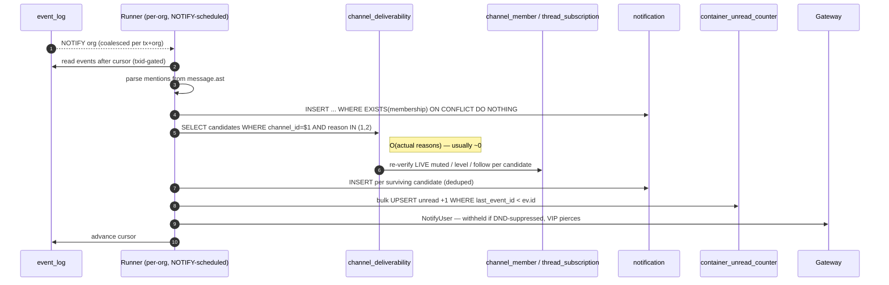

# The core data model — messages, containers, per-user state, and the hot paths

*A teaching document. `docs/SCHEMA.md` records the rules; this file shows the
shapes and derives WHY they are the shapes. Everything here is read out of
`migrations/0001..0025` and the code that queries them — no aspirational
tables. Diagrams are Mermaid; they render on GitHub.*

Read order: **§1 the one-primitive idea → §2 the diagrams → §3 the five laws
that decide "same table or new table" → §4 each satellite table on trial →
§5 the hot paths, step by step → §6 the cost table → §7 designs we rejected.**

---

## 1. The one idea the whole model is built on

Slack has channels and DMs and threads. Jira has issues with comment streams.
Zulip has streams with topics. Four containers, four content systems, four
read-state systems, four search indexes.

Weft has **one content primitive — the thread — and one message table.**
Everything else is a *container* that a thread points at (ADR-001 D1/D2, F-5):

```
thread.channel_id  ─┐
thread.dm_space_id ─┼─ exactly one is non-NULL (a CHECK enforces it)
thread.space_id    ─┘
```

That single CHECK is the highest-leverage line in the schema:

```sql
CHECK (num_nonnulls(channel_id, dm_space_id, space_id) = 1)
```

*(migrations/0004_messaging.sql)*

It means there is exactly **one governing container** per thread, so "who may
read this?" always has one answer, "what retention policy applies?" always has
one owner, and a legal hold never has to reconcile two claimants. Zulip's
`Message` has both `recipient_id` (stream *or* huddle *or* personal) and a
subject; Slack's model has `channel` for everything and encodes DM-ness in the
channel id prefix. Both work. Ours makes the container *typed and singular*,
which is what lets a Space thread (a Jira-style work-item discussion) and a
channel thread share the entire messaging module.

Corollaries you will see everywhere below:

- **A "group chat" is not a third kind of thing.** It is a `dm_space` with
  `kind = 2`. A 1:1 DM is `kind = 1`, a note-to-self is `kind = 3`. Same table,
  same participant table, same message path.
- **A flat channel is a thread too.** Every channel has a `root_thread_id`
  pointing at a `thread` with `kind = 2` (`channel_root`). Messages posted "to
  the channel" land in that thread. So the flat-channel case needs *no* special
  read-state, no special unread math, no special search — it reuses the thread
  machinery for free (F-15).
- **A work item's description is a message.** No `description` column on
  `work_item`; the item owns a thread and its root message *is* the
  description. Edits, AST, search, mentions come free.

---

## 2. The diagrams

### 2.1 Layers — what points at what



Two things to notice. First, the per-user satellites hang off **containers and
threads**, not off messages — with three deliberate exceptions (`pin`,
`saved_item`, `reaction`, plus the sparse `message_user_flag`), and every one
of those exceptions is *sparse by construction*. Second, nothing in the content
plane points back up into the per-user plane. Messages do not know who read
them. That is the whole trick, and §4.1 does the arithmetic.

### 2.2 Core entity relationships



### 2.3 The three container shapes, side by side



One `message` table serves all four. One read-state table serves all four. One
search index serves all four.

### 2.4 The per-user state satellites, with cardinality

This is the diagram to internalize. **`N` = messages, `U` = container members,
`T` = threads.**

```mermaid
erDiagram
    channel_member {
        bigint channel_id PK
        bigint user_id PK
        timestamptz joined_at
        timestamptz history_from "F-16b protected-history floor"
        smallint level "0 inherit 1 all 2 mentions 3 nothing"
        boolean muted "SEPARATE flag, not a level"
        boolean pinned
        smallint notif_desktop "-1 off 0 inherit 1 on"
        smallint notif_push
        smallint notif_email
        smallint notif_sound
        smallint wildcard_mentions_notify
        timestamptz unsubscribed_at "row SURVIVES unsubscribe"
    }
    thread_read_watermark {
        bigint user_id PK
        bigint thread_id PK
        bigint last_read_message_id "monotone"
        timestamptz updated_at
    }
    thread_subscription {
        bigint thread_id PK
        bigint user_id PK
        smallint state "1 followed 2 muted 3 unmuted"
    }
    message_user_flag {
        bigint user_id PK
        bigint message_id PK
        smallint flag PK "1 starred 2 mentioned 3 marked-unread 4 alert-word"
    }
    container_unread_counter {
        bigint user_id
        bigint channel_id "exactly one"
        bigint dm_space_id "of these two"
        int unread_count "maintained CACHE"
        int mention_count
        bigint last_event_id "idempotency high-water"
        bigint org_id FK
    }
    channel_deliverability {
        bigint channel_id PK
        bigint user_id PK
        smallint reason PK "1 follows-here 2 level=all 3 alert-word"
        smallint medium PK "1 in_app"
        bigint org_id FK
    }
    pin {
        bigint channel_id PK
        bigint message_id PK
        bigint pinned_by FK
        timestamptz pinned_at
    }
    saved_item {
        bigint user_id PK
        bigint message_id PK
        smallint kind "1 saved-for-later 2 star"
    }
    reaction {
        bigint message_id PK
        bigint user_id PK
        text emoji PK
        smallint kind "1 emoji 2 vote"
    }
    notification {
        bigint id PK
        bigint org_id FK
        bigint user_id FK
        smallint kind "dm/mention/followed/keyword/activity"
        smallint entity_type
        bigint entity_id
        bigint actor_id FK
        bigint batch_id "F-17b coalescing"
        timestamptz seen_at
        timestamptz read_at
        timestamptz emailed_at
    }
```



| Table | Rows grow as | Written when |
|---|---|---|
| `message` | `N` | once per send |
| `channel_member` | `U` per channel | join / pref change (rare) |
| `thread_read_watermark` | `U × T` | mark-read (very hot, but **in place**) |
| `container_unread_counter` | `U` per container | consumer pass + mark-read (**in place**) |
| `channel_deliverability` | ≤ `U`, usually ≪ `U` | rare invalidation events only |
| `thread_subscription` | sparse | explicit follow/mute |
| `message_user_flag` | **sparse** | only real exceptions |
| `pin` | ~10s per channel | explicit pin |
| `saved_item` | sparse | explicit save |
| `reaction` | sparse | explicit react |
| `notification` | `O(reasons)` per message | consumer pass |

**Nothing in this table grows as `N × U`.** That is the design, stated as a
budget. §4.1 shows what it buys.

---

## 3. The five laws that decide "same table or new table"

When you are about to add a field, run it through these in order. They are not
style preferences; each one has a measurable failure mode.

### Law 1 — Cardinality asymmetry splits tables

If a fact is about *one message*, it belongs on `message`. If it is about *one
message per user*, it belongs somewhere else, and that somewhere else had
better be sparse.

`message.edited_at` is a property of the message: one value, one row. ✅ column.

"Has Alice read message 8,412?" is a property of the *pair*. There are `N × U`
pairs. If you materialize the pair you have bought an `N × U` table, and the
whole rest of the system now inherits that number: every send writes `U` rows,
every backfill index is `N × U` wide, every retention purge deletes `N × U`
rows, every replica has to stream it.

### Law 2 — Write-frequency asymmetry splits tables

Postgres has no column-level locking. An `UPDATE` writes a whole new tuple
version. So **a hot-updated field poisons every cold field it shares a row
with.**

`message` rows are *wide*: `source` + `ast` (JSONB) + `rendered` +
`search_tsv`. A message with 400 words of markdown is a multi-kilobyte row,
often TOASTed. If you put `read_count` on `message` and bumped it on every
read, every bump would rewrite that entire wide tuple, re-index `search_tsv`,
and generate WAL proportional to the message body — for a counter.

So hot-updated state lives in narrow tables of its own, and those tables are
tuned for in-place updates:

```sql
CREATE TABLE thread_read_watermark (...) WITH (fillfactor = 85);
CREATE TABLE channel_member          (...) WITH (fillfactor = 90);
CREATE TABLE container_unread_counter(...) WITH (fillfactor = 85);
CREATE TABLE channel_deliverability  (...) WITH (fillfactor = 90);
```

`fillfactor < 100` leaves free space in every heap page so an update can place
the new tuple version **on the same page** — a HOT (heap-only tuple) update,
which skips index maintenance entirely. That optimization is only available
because these tables are narrow and their updated columns are unindexed. It
would be worthless on `message`.

### Law 3 — Query shape, not entity shape, decides the index

A table exists to serve a query. Look at the queries, then draw the table.

- "The user's unread badges on app boot" wants **one index scan keyed by
  `user_id` returning `O(their containers)` rows.** That is
  `container_unread_counter (user_id, channel_id)`.
- "Who should be notified about this message?" wants **`O(actual reasons)`
  rows, not `O(members)`.** That is `channel_deliverability (channel_id,
  reason)`.
- "The pinned messages in this channel" wants a tiny table keyed by
  `channel_id`. That is `pin`.

Fusing any two of these into one table gives you an index that serves neither
well, because the leading column can only be one thing.

### Law 4 — Absence is the cheapest possible default

Every satellite table is designed so that **zero rows means the default**.

- No `thread_subscription` row → inherit the channel level. (Zulip's UserTopic
  four-state, encoded as three explicit states plus absence.)
- No `notification_medium_pref` row → email on for DM+mention, off otherwise.
- No `message_user_flag` row → not starred, not mentioned, not flagged.
- No `channel_deliverability` row for a user → they have no non-default reason
  to be pinged in that channel.

This is why a 100k-member channel where nobody opted into `level = all` has
**zero** `channel_deliverability` rows and a normal message resolves only its
explicit mentions. Storage tracks *deviation from default*, and in a chat
product deviation is rare.

The corresponding trap — and CLAUDE.md names it "honest rungs" — is storing a
setting that nothing reads. A knob whose consumer does not exist gets
*rejected* with a clear error, not silently persisted. A row that means nothing
is worse than no row.

### Law 5 — Different lifecycles cannot share a row

Retention, legal hold, and GDPR erasure operate on different clocks:

- `message` content is purged by retention policy.
- `message_revision` holds pre-edit and pre-delete content and is what
  compliance export reads and what `scrub` erases.
- `thread_read_watermark` is *not* content and must survive content deletion —
  a purged message must not resurrect as unread.
- `notification` rows are ephemeral UI state and age out independently.

Merge any two of those and you get a purge that either destroys audit evidence
or leaves content behind. The split is what makes "delete = revision-append"
(F-8) work: live fields are cleared on `message`, the prior content lands in a
`message_revision` with `kind = 4`, the event-log row stays structural, and
GDPR erasure becomes a *revision row delete* rather than a log rewrite.

---

## 4. Each satellite table, on trial

### 4.1 Read state — `thread_read_watermark` (F-7)

**The naive design.** One row per (user, message) with a flags bitfield. This
is exactly Zulip's `UserMessage` (`zerver/models/messages.py:583`), which
carries partial indexes for `starred`, `mentioned`, unread, and
`has_alert_word`. It is a good design and it is battle-tested — and Zulip
themselves document it as their scaling ceiling.

**The arithmetic.** A 10,000-member channel. One message.

| Design | Rows written per message | Rows for 1M messages |
|---|---|---|
| Dense per-(user, message) | 10,000 | 10,000,000,000 |
| Watermark per (user, thread) | 0 | 10,000 total, ever |

The watermark table does not grow with `N` **at all**. It is `O(U × T)` — one
row per reader per thread they have ever opened — and it is *updated in place*
forever after.

```sql
CREATE TABLE thread_read_watermark (
    user_id              BIGINT NOT NULL REFERENCES user_account (id),
    thread_id            BIGINT NOT NULL REFERENCES thread (id),
    last_read_message_id BIGINT NOT NULL DEFAULT 0,
    updated_at           TIMESTAMPTZ NOT NULL DEFAULT now(),
    PRIMARY KEY (user_id, thread_id)
) WITH (fillfactor = 85);
```

**Why a watermark works at all:** message ids are a monotone `BIGINT` identity
sequence, so "read up to id X" is a total order over the thread. Unread =
`m.id > watermark AND m.author_id <> me AND m.deleted_at IS NULL`.

**Why the flat-channel case is free:** the channel-root thread (`kind = 2`)
means posting-to-the-channel is posting-to-a-thread, so a user who reads a flat
channel has exactly *one* watermark row for it. No special case in the code, no
second table.

**The monotone guarantee, and why the row is locked.** From
`internal/domain/messaging/readstate.go`:

```sql
INSERT INTO thread_read_watermark (user_id, thread_id, last_read_message_id, updated_at)
VALUES ($1, $2, $3, now())
ON CONFLICT (user_id, thread_id)
DO UPDATE SET last_read_message_id =
       GREATEST(thread_read_watermark.last_read_message_id, EXCLUDED.last_read_message_id),
       updated_at = now()
RETURNING last_read_message_id
```

`GREATEST` makes an out-of-order mark from a second device a no-op instead of a
rewind. The preceding `SELECT ... FOR UPDATE` serializes concurrent marks on
the same `(user, thread)` so their unread *deltas* cover disjoint ranges (§4.3).
And the value is clamped to a real message id in the thread, so a client cannot
push its watermark past reality.

**Mark-read is deliberately not event-logged.** It is among the highest-volume
actions in a chat product — one per channel view — and writing it to the
durable spine would bloat the log for millions of users. The watermark table
*is* the durable truth; live multi-device sync rides the ephemeral path
(ADR-002 P5) when it lands. This is a case where the honest answer was "this
fact does not deserve the event log."

### 4.2 Sparse exceptions — `message_user_flag`

The watermark handles the *common* case (a contiguous read prefix). Some facts
genuinely are per-(user, message) and cannot be derived from an ordering:

```sql
CREATE TABLE message_user_flag (
    user_id    BIGINT NOT NULL REFERENCES user_account (id),
    message_id BIGINT NOT NULL REFERENCES message (id),
    flag       SMALLINT NOT NULL,  -- 1 starred · 2 mentioned · 3 marked-unread · 4 alert-word
    created_at TIMESTAMPTZ NOT NULL DEFAULT now(),
    PRIMARY KEY (user_id, message_id, flag)
);
CREATE INDEX message_user_flag_message_idx ON message_user_flag (message_id);
```

This is the *same information* Zulip's `UserMessage.flags` bitfield carries —
with one difference that changes the growth curve entirely: **Zulip writes a
row for every recipient of every message and sets bits on it; we write a row
only when a bit would be set.**

Zulip needs the dense row because `read` is one of the flags, so a row must
exist for everyone. We took `read` out (§4.1) and the table collapsed into a
sparse exception list. Mentions in a busy channel are single-digit per message.
Stars are rarer. "Marked unread" is rarest.

Note `flag` is part of the primary key rather than a bitmask column. Two
reasons: a bitmask column would be *updated* (row churn, and a concurrent
star + mention is a lost-update race), while separate rows are *inserted and
deleted* independently; and each flag gets clean index selectivity without
needing a partial index per bit.

### 4.3 The unread badge — `container_unread_counter` (S6)

Read state (§4.1) answers "is this thread unread?" in `O(1)`. But the sidebar
badge asks a harder question: *"across all my channels, how many unread?"*
Answering that from the watermark alone means an aggregate over
`channels × messages-since-watermark` — on every app boot, for every user. In a
high-volume channel that is `O(N)` on a **read** path, which is the wrong place
for it.

So the counter is a **cache**, and the split is deliberate:



Where each mutation lands:

| Event | Where the work happens | Cost |
|---|---|---|
| **Increment** (new message) | the async notification consumer pass, *not* `messaging.Send` | one set-based bulk UPSERT over live members |
| **Decrement on read** | inside `MarkRead`'s transaction | `O(the slice just read)`, never a container-wide recompute |
| **Decrement on delete** | inside `DeleteMessage`'s transaction | `O(members)` |
| **Reconcile** | slow ticker on the notification runner | full recompute from the watermark, repairs + warns |

Two things worth stealing from this design:

**Idempotency without exactly-once.** The event-log consumer delivers
at-least-once — a crash between processing and cursor-ack replays a batch. So
every counter row carries `last_event_id`, and an increment applies only where
`last_event_id < the event's id`. A replay is arithmetically a no-op. No
distributed transaction, no dedup table; a high-water mark on the row itself.

**Bounded, self-healing drift is an acceptable answer.** If a user marks a
message read *before* the consumer has counted it, the decrement subtracts
first and the increment adds later — `+1` drift for one consumer-lag window,
floored at zero, healed by the reconcile sweep. The alternative (making
mark-read wait for the consumer, or recompute the container) hands the removed
`O(N)` right back on the hottest write path. The design writes the drift down,
bounds it, tests it, and sweeps it. That is honest; pretending the cache is the
truth would not be.

`mention_count` is held `≤ unread_count` by a `LEAST` clamp so a full read
always clears the badge. It is documented as best-effort: it can linger after a
partial read, but it never *misses* a live mention.

### 4.4 Mentions — why the concept lives in **three** tables

"Mention" is not one fact. It is three, with three different lifecycles, and
collapsing them is a classic modelling error:



1. **The mention itself is content.** It lives in `message.ast`. It survives
   edits as revisions, it is searchable, it renders. Nothing per-user about it.
2. **Candidacy is a cache** — `channel_deliverability`, §4.5.
3. **"This user has been notified" is a durable, deduped, user-scoped fact** —
   the `notification` row, with its own read/seen/emailed lifecycle.

The `notification` table earns its existence on the dedupe key alone:

```sql
CREATE UNIQUE INDEX notification_dedupe_key
    ON notification (user_id, kind, entity_type, entity_id);
```

This is simultaneously (a) the at-least-once idempotency guard for the consumer
and (b) the product rule that two `@alice` in one message must not double-badge
her. One index, two jobs — and note that it makes the *product* rule structural
rather than a thing application code must remember.

The `insert` is also a lesson in gate placement. From
`internal/domain/notification/runner.go`:

```sql
INSERT INTO notification (org_id, user_id, kind, entity_type, entity_id, actor_id, created_at, batch_id)
SELECT $1, $2, $3, $4, $5, $6, $7, $9
WHERE $8 = 0 OR EXISTS (
    SELECT 1 FROM channel_member
    WHERE channel_id = $8 AND user_id = $2 AND unsubscribed_at IS NULL)
ON CONFLICT (user_id, kind, entity_type, entity_id) DO NOTHING
```

The membership check is **inside the INSERT**, not a separate query before it.
A check-then-write pair has a window in which the user leaves the channel
between the two statements and still gets notified about a message they can no
longer read. As one statement, there is no window. This is the "gates inside
the transaction/INSERT" invariant, and it is the same shape used by
`files.AttachEntityReferences`.

Also on `notification`: `batch_id` + a *partial* unique index
`(user_id, kind, batch_id) WHERE batch_id IS NOT NULL`. Bulk producers (sprint
close, retention vacuum) fold `N` per-item notifications into one digest row,
so a 100k-item bulk event cannot mint 100k rows per user. The partial index
means the unbatched hot path pays nothing for the feature. The migration
comment carries a hard-won contract: `batch_id` must be minted from the
triggering *event id*, never a stable entity id — a stable id would deliver the
first sweep and then silently mint zero notifications forever.

### 4.5 Fan-out candidacy — `channel_deliverability` (F-17)

The question "who should be notified about this message?" has a naive answer:
scan `channel_member`. That is `O(members)` **per message**, which is exactly
what a 100k-member channel cannot afford.

The insight: *notification-worthiness is almost always the default, and the
default is "no."* So materialize only the non-default reasons.

```sql
CREATE TABLE channel_deliverability (
    channel_id BIGINT NOT NULL REFERENCES channel (id),
    user_id    BIGINT NOT NULL REFERENCES user_account (id),
    reason     SMALLINT NOT NULL,  -- 1 follows-a-thread-here · 2 level=all · 3 alert-word-holder
    medium     SMALLINT NOT NULL,
    org_id     BIGINT NOT NULL REFERENCES org (id),
    PRIMARY KEY (channel_id, user_id, reason, medium)
) WITH (fillfactor = 90);

CREATE INDEX channel_deliverability_reason_idx ON channel_deliverability (channel_id, reason);
```

A 100k-member channel where nobody set `level = all` and nobody follows a
thread has **zero rows here**, so a normal message resolves only its explicit
mentions. The `O(members)` work moved to *rare* events — level edits, follows,
alert-word changes, joins/leaves, and one lazy first build stamped by
`channel.deliverability_built_at`.

**The cache/truth split is stated as a safety property**, and it decides the
failure mode. `channel_member` / `thread_subscription` / `alert_word` remain
the source of truth, and the consumer **re-verifies live settings per
candidate**:

```sql
SELECT DISTINCT cd.user_id, cm.muted, cm.level, COALESCE(ts.state, 0::smallint)
FROM channel_deliverability cd
JOIN channel_member cm ON cm.channel_id = cd.channel_id
     AND cm.user_id = cd.user_id AND cm.unsubscribed_at IS NULL
LEFT JOIN thread_subscription ts ON ts.thread_id = $2 AND ts.user_id = cd.user_id
WHERE cd.channel_id = $1 AND cd.reason IN (1, 2) AND cd.medium = 1
  AND cd.user_id <> $3
```

Therefore: **a stale-extra row costs one wasted scan; only a stale-missing row
can drop work** — and the reconciliation sweep repairs and logs those. The
cache caches *candidacy*, never *settings*. Note also the ordering of the
tri-state logic afterwards:

```go
if !((followed && !x.muted) ||
     (x.level == 1 && x.tsState != 2 && (!x.muted || x.tsState == 3))) { continue }
```

Mute is a **separate boolean, not a level** — verified against Slack's actual
behavior — because you need "muted channel, but this one thread un-muted"
(`tsState == 3`), which a single ordinal level cannot express.

### 4.6 Membership *and* preferences — why `channel_member` fuses them

This one goes the other way, and shows the laws are a balance, not a ritual.

`channel_member` holds both the join fact and ten preference columns (`level`,
`muted`, `pinned`, `color`, four `notif_*` tri-states,
`wildcard_mentions_notify`, `history_from`). By Law 5 you might split
"membership" from "preferences." We don't, because:

- Cardinality is **identical** — exactly one preference set per membership.
  There is no `N × U` risk (Law 1).
- Both are **cold-written** — you join once and change prefs rarely (Law 2).
- Every hot read wants them **together**: the fan-out candidate scan above
  joins membership and reads `muted` + `level` in the same row touch. Splitting
  would add a join to the hottest query in the system (Law 3).

And note the tri-states are **real columns, not JSONB**, with a comment in the
migration saying exactly why: they are on the notification fan-out path.
Compare `channel.settings JSONB`, which holds the policy long tail nobody
queries per-message. The rule from SCHEMA.md: *JSONB for the long tail;
anything on a hot query path gets a real column.*

Two more details worth copying:

- **The row survives unsubscribe.** `unsubscribed_at` is set rather than the
  row deleted, so `history_from` — the protected-history floor — is never lost.
  Delete the row and a rejoin would silently grant access to history the user
  was never allowed to see. Every read filters `unsubscribed_at IS NULL`.
- **`history_from` is a plain column predicate**, evaluated inline in the ACL
  (see §5.2), not a subquery or a function. Protected history costs one
  comparison.

### 4.7 `pin` — channel-scoped, not user-scoped

```sql
CREATE TABLE pin (
    channel_id BIGINT NOT NULL REFERENCES channel (id),
    message_id BIGINT NOT NULL REFERENCES message (id),
    pinned_by  BIGINT NOT NULL REFERENCES user_account (id),
    pinned_at  TIMESTAMPTZ NOT NULL DEFAULT now(),
    PRIMARY KEY (channel_id, message_id)
);
```

Why not a `pinned BOOLEAN` on `message`? Three reasons, one per law:

1. **A pin is a channel-scoped fact, not a message-scoped one.** The PK is
   `(channel_id, message_id)`. Once cross-posting or a shared channel projects
   a message into a second container, "is it pinned" has *two* answers. A
   boolean on `message` can hold only one.
2. **It carries its own attribution** — `pinned_by`, `pinned_at`. Those would
   be two more nullable columns on the widest table in the schema, NULL for
   99.99% of rows (Law 2).
3. **The query is "the pins in this channel."** With the pin table that is a
   ~10-row PK-prefix scan. With a boolean on `message` it is a scan over the
   channel's *entire* message history filtered by a low-selectivity flag —
   requiring a partial index on `message` that must be maintained on every send
   (Law 3).

Contrast `saved_item`, which is the *user*-scoped twin: PK
`(user_id, message_id)`, "my saved items" is a `user_id`-prefix scan. Same
shape, different owner — and that difference is precisely why they are two
tables and not one with a nullable `user_id`.

And contrast `message.has_attachment` / `has_link` / `has_image`, which *are*
booleans on `message`. Those are properties of the content itself, computed
once at insert from the AST, never updated, and they exist to make
`has:link`-style search predicates index-cheap. Same reasoning applied to
different facts gives different answers — which is the point.

### 4.8 `reaction` — the composite key does the work

```sql
PRIMARY KEY (message_id, user_id, emoji)
```

That key alone enforces "one user, one of each emoji, per message" — no
application check, no race. Reading a message's reactions is a `message_id`
prefix scan; toggling is an insert or delete, never an update, so there is no
lost-update window. `kind` distinguishes emoji from Jira-imported votes, so
importer semantics ride the same table.

### 4.9 Provenance — the same four columns, twelve times

`org`, `channel`, `thread`, `message`, `user_account`, `user_group`, `space`,
`work_item` and more each carry:

```sql
origin_system TEXT, origin_id TEXT, origin_meta JSONB
-- plus, per table:
CREATE UNIQUE INDEX <t>_origin_key ON <t> (org_id, origin_system, origin_id)
    WHERE origin_system IS NOT NULL;
```

Repeated deliberately rather than factored into a shared `external_id` table.
The partial unique index makes every import upsert **idempotent** — re-running
a Slack import cannot double-create — and because it is partial, native rows
pay nothing: no index entry, no storage. A shared table would have cost a join
on every import lookup and a global uniqueness scope, which violates the cell
invariant (§5.6).

---

## 5. The hot paths

"Hot path" here means: what runs per message, per read, per connected client —
the things whose complexity class determines whether the system has a ceiling.

The governing rule, and it is worth stating before the details:

> **The write path is `O(1)`. Fan-out is `O(reasons)`. The read path is
> `O(the user's containers)`. No path is `O(members)` and no path is `O(N)`.**

Where `O(members)` work is unavoidable, it is moved off the request onto the
async consumer or a rare invalidation event.

### 5.1 Hot path A — sending a message



Measured end to end on localhost, warm: **~3.8 ms** for the whole transaction
(auth token lookup, `(verb,scope)→group` resolve, AST parse + render, insert,
event append, `pg_notify`, commit) — `docs/PERF.md`.

**What is *not* in that transaction, and why each was evicted:**

| Not in the send tx | Where it went | Why |
|---|---|---|
| Notification resolution | async consumer (§5.4) | would be `O(members)` inline |
| Unread counter increments | same consumer pass | `O(members)` writes |
| Per-recipient read rows | **nowhere — they don't exist** | F-7 (§4.1) |
| Email / push delivery | separate workers off `notification` | external I/O in a tx is a stall |
| Link preview fetch | background worker | third-party latency |

Four structural details in that flow:

- **`deliverToThreadOpts` is THE gated send.** Normal send, forward, and
  scheduled-message delivery all route through it. One gate means one place to
  audit, and a new caller cannot accidentally skip the container check. (The
  LLD rule: no duplicated derivations.)
- **Domain write + `eventlog.Append` in ONE transaction** (the outbox rule).
  There is no window where a message exists without its event or vice versa.
  `NOTIFY` fires at *commit* time, so a consumer woken by it always finds the
  row.
- **The activity bump is skipped for `kind = 2`** channel-root threads (F-15).
  Otherwise every message in a busy channel would `UPDATE` the *same*
  `thread` row — a single hot row serializing the entire channel's write
  throughput. The busiest container in the product is precisely the one that
  must not have a denormalized counter.
- **`created_at` is domain time, not wall time.** An imported 2019 Slack
  message sorts as 2019. This is why importers must never notify (actor kind
  4) — a backfill would otherwise light up every badge in the org.

### 5.2 Hot path B — reading a channel (the ACL shape)

Every read of message content runs the **three-way container ACL**. It is one
`WHERE` clause with no joins to a permission service, and it must be reused
verbatim rather than reinvented (`messaging.Get`, `messaging.ListMessages`,
`files.OpenDownload`, `reactions.loadReactable`):

```sql
WHERE m.id = $1 AND m.org_id = $3 AND m.deleted_at IS NULL
  AND (   (m.channel_id IS NOT NULL AND (
             EXISTS (SELECT 1 FROM channel_member cm
                     WHERE cm.channel_id = m.channel_id AND cm.user_id = $2
                       AND cm.unsubscribed_at IS NULL)
          OR EXISTS (SELECT 1 FROM channel c
                     WHERE c.id = m.channel_id AND c.visibility = 3
                       AND c.archived_at IS NULL)))
       OR (m.dm_space_id IS NOT NULL AND
             EXISTS (SELECT 1 FROM dm_participant dp
                     WHERE dp.dm_space_id = m.dm_space_id AND dp.user_id = $2))
       OR (m.channel_id IS NULL AND m.dm_space_id IS NULL))
  AND NOT EXISTS (            -- F-16b protected-history floor
        SELECT 1 FROM channel c2
        JOIN channel_member cm2 ON cm2.channel_id = c2.id
          AND cm2.user_id = $2 AND cm2.unsubscribed_at IS NULL
        WHERE c2.id = m.channel_id AND c2.history_mode = 2
          AND cm2.history_from IS NOT NULL
          AND m.created_at < cm2.history_from)
```

Three branches — channel membership (or live web-public), DM participation,
org-visible space thread — matching the three container legs of §1 exactly.

**This is why `channel_id` and `dm_space_id` are denormalized onto `message`.**
Without them, the hottest read in the product would join through `thread` to
reach the container before it could even *start* evaluating the ACL. `thread`
remains the source of truth; the copies exist purely for read locality. That is
denormalization #2 of the five SCHEMA.md sanctions, and it earns its keep here.

**Oracle-free 404s.** Notice the ACL is part of the same `WHERE` as the id
lookup. A message you may not read returns zero rows, indistinguishable from a
message that does not exist — `apperr.NotFound`, never a 403. A 403 would
confirm the message exists, which is an existence oracle: an attacker could
enumerate ids to map a private channel's activity. 403 is reserved for "you are
known to be short a verb," where existence is already established.

**Permission checks are one indexed lookup.** Nested groups are flattened into
`user_group_closure` (F-16) and patched incrementally on group edits, so no ACL
path ever runs a recursive CTE. Bulk rebuilds run behind a per-org version
fence — readers pin `version = current` while the next version fills, then the
pointer flips atomically — so a rebuild never blocks and never half-shows.

### 5.3 Hot path C — app boot / the sidebar badges

The single most-requested read in a chat client, and the one that most often
turns into an `O(N)` aggregate in naive designs:

```sql
SELECT channel_id, unread_count, mention_count
FROM container_unread_counter
WHERE user_id = $1 AND org_id = $2
  AND channel_id IS NOT NULL AND unread_count > 0
```

One index scan on `container_unread_counter (user_id, channel_id)`. Returns
`O(the user's channels)` rows. **Touches zero message rows.** The DM plane is
symmetric via the `dm_space_id` leg and the same partial-unique-index pattern.

Compare what this replaced — a live aggregate over each of the user's channels
× messages-since-watermark, per request. That aggregate still exists, but only
as `recomputeContainerUnread`: the reconciliation truth and `MarkRead`'s reset
value, deliberately shared so the cache and the aggregate can never drift apart
*in definition* (a different failure mode from drifting in *value*, and a much
worse one).

### 5.4 Hot path D — notification fan-out (the async spine)



The properties that make this survive scale:

- **Per-org, NOTIFY-scheduled.** Never one loop per org — idle orgs cost
  literally zero. A dispatcher polls only signaled orgs. The same rule now
  binds the hourly maintenance sweeps, which claim cell-wide with **one
  advisory lock per sweep** (never a row lock, which would hold a transaction
  open across a whole pass and stall the xmin gate) and skip any org whose
  event-log high-water mark has not moved since a pass that verified it clean.
  That settle is a **lease** with a 24h TTL, which is what bounds the drift
  classes the event log cannot see — channel level changes, thread follows,
  alert-word edits, the concurrent first-ever mark-read. Stated as a rung: an
  idle org costs nothing for up to 24h, and every org is fully verified at
  least once per 24h regardless of activity.
- **Candidate scan is `O(reasons)`**, §4.5.
- **Consumers are named, cursor-tracked, and idempotent.** Replay = reset the
  cursor. Idempotency comes from the dedupe unique index (`notification`) and
  the `last_event_id` high-water (`container_unread_counter`).
- **DND is evaluated at delivery, not at materialization.** The `notification`
  row always lands — the badge accrues even when the live ping is suppressed
  (N-4) — and only `NotifyUser` is withheld. A VIP on `priority_contact`
  pierces the snooze. Separating "recorded" from "delivered" is what lets DND
  be a *delivery* policy instead of a data-loss policy.

**The known ceiling, stated honestly.** The default poller gates consumers on
`pg_snapshot_xmin(pg_current_snapshot())`. That gate is **DB-global**: one long
transaction anywhere stalls all delivery. Worse, `txid` is stamped at a
transaction's first write while the event id is stamped at append, so a
lower-txid/higher-id transaction committing first can carry the cursor past a
lower id still in flight — that event is skipped forever. The contract for this
driver is short write transactions plus
`idle_in_transaction_session_timeout`. The scale-tier replacement is **built
and opt-in**: a logical-decoding feed behind the same `eventlog.Feed` interface
(`WEFT_EVENT_FEED_DRIVER=logical`), where WAL order *is* commit order and the
gate disappears entirely.

A related trap worth internalizing: `consumer_lag` measures the backlog
**without** the gate, because a backlog measured through the horizon that
caused the backlog reads zero. Metrics must not be computed through the
mechanism they are meant to observe.

### 5.5 Hot path E — search

```sql
CREATE INDEX message_search_idx ON message USING gin (search_tsv);
```

`search_tsv` is maintained by the writer (not a trigger — the writer already
has the AST in hand, and a trigger would hide cost from the module that owns
the write). `has_attachment` / `has_link` / `has_image` make `has:link`-style
filters index-cheap rather than requiring an AST scan. The column is
backend-neutral: PGroonga or an external engine can replace it behind identical
query semantics, and pgvector embeddings will live in their own table rather
than inline, because row width on `message` is a hot-path cost (Law 2 again).

### 5.6 What every hot path shares: `org_id`

Every tenant-scoped row carries `org_id`, every query pins it, and joins carry
the pin too (`h.org_id = f.org_id`). This is doing three jobs at once:

1. **Isolation** — cross-org state is never shared; a missing pin is a tenancy
   bug, and having the column on every table makes the missing pin greppable.
2. **Index locality** — per-org scans stay in a contiguous key range.
3. **The sharding seam** — one Postgres serves the small case, org-hash
   sharding inside a cell is the intermediate step, and cells are the endgame.
   Because `org_id` is already in every query path, hash-partitioning `message`
   by org later is a table rewrite but **no query change**.

The governing constraint — the cell invariant — is: **no cross-org global state
or coordination, ever.** No global sequences, no cross-org transactions, no
global uniqueness outside the routing layer. Cross-org sharing (ADR-004) works
by *projection* between orgs, peer-style, never shared state. This is the rule
that makes "capacity = per-cell capacity × cell count" honest arithmetic
instead of a slogan, and a PR that breaks it fails review no matter how
convenient it is.

---

## 6. The cost table

Per message sent, per user with the channel open, and at rest. `U` = container
members, `N` = messages, `R` = actual notification reasons (typically ≪ `U`).

| Operation | Rows written | Rows read | Complexity |
|---|---|---|---|
| Send a message | 1 `message` + 1 `event_log` + 1 `thread` bump | ACL: `O(1)` | **`O(1)`** |
| Send to a channel-root thread | 1 `message` + 1 `event_log` (no bump) | `O(1)` | **`O(1)`** |
| Fan-out resolution | `R` `notification` rows | `R` candidate rows | **`O(R)`** |
| Unread increment | `U` counter UPSERTs (async, set-based) | — | `O(U)` off-request |
| Mark a thread read | 1 watermark UPSERT + 1 counter delta | `O(slice read)` | **`O(delta)`** |
| Sidebar badges | — | `O(user's containers)` | **`O(1)` per container** |
| Open a channel | — | page of messages + `O(1)` ACL | **`O(page)`** |
| Permission check | — | 1 `user_group_closure` lookup | **`O(1)`** |
| Read state at rest | — | — | **`O(U × T)`**, never `O(N × U)` |

The row that matters is the last one. Every other line is a consequence of it.

---

## 7. Designs we rejected, and what each would have cost

| Rejected | Why it's tempting | What it costs |
|---|---|---|
| Dense per-(user, message) read rows | Trivial queries; every flag is one row; Zulip ships it | `N × U` growth. 10k-member channel = 10k rows *per send*. Zulip's documented ceiling. |
| `read_count` / `pinned` / `starred` on `message` | Fewer tables | Wide-row churn on every update; TOAST rewrites; `search_tsv` re-index — for a boolean (Law 2) |
| Scan `channel_member` per message for fan-out | Obvious and always correct | `O(members)` per message. F-17 moves it to rare events instead |
| Live unread aggregate on every request | No cache to keep coherent | `O(N)` on the hottest **read** path. S6 makes it `O(1)` and makes the cache self-healing |
| Recompute the container counter on mark-read | Cache stays exactly correct | Hands the removed `O(N)` back on the hottest **write** path. Delta + bounded drift + sweep is the trade |
| Mute as a level value | One ordinal instead of a flag + a boolean | Cannot express "muted channel, this thread un-muted." Verified against Slack |
| Mark-read into the event log | Uniform spine; free multi-device sync | Highest-volume action in the product; would bloat the log for millions. Ephemeral path instead |
| Separate DM / channel / work-item message tables | Each shape optimized locally | Four content systems, four read-state systems, four search indexes, four ACLs to keep in sync |
| A shared `external_id` table for provenance | DRY | A join on every import lookup + global uniqueness scope, which breaks the cell invariant |
| UUID primary keys | Globally unique, merge-friendly | 2× index width, no insert locality, B-tree fragmentation on the hottest tables |
| Postgres `ENUM` types | Real type safety | `ALTER TYPE ... ADD VALUE` cannot run in a transaction; values cannot be removed. `SMALLINT` + a Go registry gives the same integrity with free evolution |
| Preferences in `channel_member.settings` JSONB | Schema-free evolution | `muted` and `level` are read on the fan-out path — they must be real columns. JSONB is for the long tail |

---

## 8. The one-paragraph summary

One thread primitive with exactly one governing container means one messaging
module, one ACL shape, one search index, and one read-state system serving
channels, DMs, group chats, and work items alike. Per-user state lives in its
own narrow, high-fillfactor tables — never as columns on the wide `message` row
and never as a dense per-(user, message) row — so read state is `O(threads)`
and nothing in the schema grows as `N × U`. Where per-member work is genuinely
required, it is moved off the request path onto an async, cursor-tracked,
idempotent consumer, and where a cache replaces an aggregate the truth is named
explicitly, the drift is bounded and swept, and the cache's failure mode is
chosen so that staleness costs a wasted scan rather than a dropped
notification. Everything carries `org_id`, nothing coordinates across orgs, and
that is what makes adding cells the answer to scale.

---

### Where to look next

| Question | File |
|---|---|
| The DDL and its inline rationale | `migrations/0001..0025` |
| The rules, compressed | `docs/SCHEMA.md` |
| Module map, layering, infra seams | `docs/ARCHITECTURE.md` |
| Measured numbers and the load rig | `docs/PERF.md`, `docs/PERF-megaorg.md` |
| What is actually built vs designed | `docs/REALITY.md` |
| The decisions themselves | `~/Documents/oss-chat-platform/adr/ADR-001..014` |
